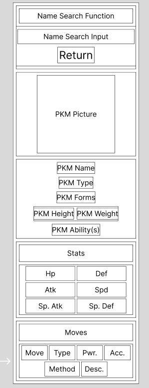

<br>
<br>

# PokeDex Application

<br>
<br>
Using 

https://pokeapi.co/api/v2/pokemon/(name)/

---

## Things to Do

<br>
<br>

Fix the "Forms" Line (Extract URL from JSON and then grab Evolution Names)
Need to fetch in parrallel learn about Promise.all() and use it in combination with my async fetch function
Then update.

```

Normal Fetch ---> Parsing Data ---> Secondary Fetch for Species ---> Parsing Secondary Data ---> Tertiary Fetch For Evolutions ---> Parse Evolutions Data ---> Loop through 

```

Update Documentation and Code ---- Forms === Evolution Chain / Species
JSON data handle this with the "species": key


Adding a Moves and Stats Grid

Stat Grid, the original call returns stats.

<br>
<br>

Moves Grid

Stuff I need from the data
```
"id": "exampleinteger"
"name": "example"
"accuracy": "exampleinteger"
"power": "exampleinteger"
"flavour_text_entries": [
    "flavor_text": 
]

```

I need the id to make a secondary call for the learn methods.
https://pokeapi.co/api/v2/move-learn-method/{id or name}/

```
"name": "example"

```
Possibly all I need from the Learn Method JSON

Then afterwards I need to create a HTML table using ``<table>`` and it's subtags

<br>
<br>
<br>

---

## Data Used and Things Done

```
HTML id=PkmName === JSON "name": "example"

HTML id=PkmType === JSON "types": "example"

HTML id= PkmForms === JSON "forms": = [
    {
        "name": "example",
        "url": "https://pokeapi.co/api/pokemon-form/example/"
}
], 
```

Pull the names from this API call, specifically the names.

```
HTML id=PkmHeight === JSON "height": "integer"
HTML id=PkmWeight === JSON "weight": "integer"

HTML id=PkmAbility === JSON "Ability(s) = "abilities": [
    {
    "ability": {
    "name": "torrent",
    "url": "https://pokeapi.co/api/v2/ability/67/"
    },
    "is_hidden": false,
    "slot": 1
    },
    {
    "ability": {
    "name": "rain-dish",
    "url": "https://pokeapi.co/api/v2/ability/44/"
    },
    "is_hidden": true,
    "slot": 3
}
], 
```
No need to utilize the other API calls, the name is enough.
Maybe add a second function for Abilities
It would have to render an entirely new layout with the ability information.
Use Single Page App stuffs

----

For Pokemon Image -
Using the Pokemon Showdown Sprites
```"sprites": {
    ---etc---
    ---etc---
    ---etc---
      "showdown": {
        "back_default": "https://raw.githubusercontent.com/PokeAPI/sprites/master/sprites/pokemon/other/showdown/back/7.gif",
        "back_female": null,
        "back_shiny": "https://raw.githubusercontent.com/PokeAPI/sprites/master/sprites/pokemon/other/showdown/back/shiny/7.gif",
        "back_shiny_female": null,
        "front_default": "https://raw.githubusercontent.com/PokeAPI/sprites/master/sprites/pokemon/other/showdown/7.gif",
        "front_female": null,
        "front_shiny": "https://raw.githubusercontent.com/PokeAPI/sprites/master/sprites/pokemon/other/showdown/shiny/7.gif",
        "front_shiny_female": null
      }
    },
```
Specifically use "front_default":

Can add the back sprite later and maybe a switcher to select the shiny and female sprites.

-------- 

## Wireframing

